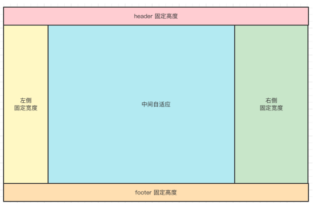

# CSS
:::tip
  这里主要记录一些面试题，在准备面试的同时，复习巩固一下原来遗忘的知识，不能一直学习，一直在丢失，这样永远也不会进步，要回顾过往，期待未来！
:::

## 常见的html标签
- 行内元素：a, span, img, strong, em, b, i, abbr, code, br, q（引用）, sub（下标）, sup（上标）
- 块元素：div, p, h1, h2, h3, h4, h5, h6, ul, ol, li, form, section, article, footer, header, nav
- 行内块：input button
  
:::warning
注意，table 虽然也是独占一行，但它 display: table 不是 block;若是不知道，直接打开控制台，查看computed以后的样式
:::

## 常见Css选择器
- 元素选择器 span
- 类选择器 .button
- ID选择器 #header
- 通用选择器 *
- 后代选择器  div p
- 子元素选择器 div>p
- 相邻选择器h1+p
- 伪类选择器 a:hover
- 伪元素 p::after

## css盒子模型，尺寸计算
:::info 盒子模型
- 标准盒模型：一个元素的总宽度（或高度）是由其width（或height）、padding、border和margin共同决定的
- 怪异盒模型：元素的width属性实际上包含了内容区、内边距(padding)和边框(border)的宽度，但不包括外边距(margin)

可以通过box-sizing来改变盒模型
- box-sizing: content-box; —— 默认值，表示使用标准盒模型。
- box-sizing: border-box; —— 表示使用怪异盒模型

:::

:::tip
举个例子：请问 div1 的 offsetWidth 是多大
```javascript
<style>
  #div1 {
    width: 100px;
    padding: 10px;
    border: 1px solid #ccc;
    margin: 10px;
  }
</style>

<div id="div1"></div>
```
offsetWidth 是指 元素内容 + 内间距 + 边框的距离，不包括外间距;所以 offsetWidth 是 122px
追问：如果想要让 offsetWidth 等于 100px ，还需要再增加一个什么属性？

box-sizing: border-box;
:::

## margin 重叠和传递
:::info 
- 为什么会产生上边距传递？
  
块级元素的顶部线和父元素的顶部线重叠，那么这个块级元素的margin-top值会传递给父元素。
- 为什么会产生下边距传递？

块级元素的底部线和父元素的底部线重叠，并且父元素的高度是auto，那么这个块级元素的margin-bottom值会传递给父元素。
:::


## lineHeight 如何继承？
如下代码，``<p>`` 标签的行高将会是多少？
```javascript
<!--如下代码，p 标签的行高将会是多少？-->
<style>
  body {
    font-size: 20px;
    line-height: 200%;
  }
  p {
    font-size: 16px;
  }
</style>

<body>
  <p>AAA</p>
</body>
```

:::info
line-height 不同类型的值，继承规则是不一样的
- 写具体的数值，如 30px，则继承该数值 —— 比较好理解
- 写百分比，如 200% ，则继承当前计算出来的值，如上述题目 —— 重要！！！
- 写比例，如 2 或 1.5 ，则继承比例
  
所以，该问题的的答案是，继承 40px 。
:::

## margin 负值问题
:::info
margin-left 负值，元素左移
margin-top 负值，元素上移
margin-right 负值，自身宽度缩小，右侧元素会跟进，但内容不受影响
margin-bottom 负值，自身高度缩小，下方元素会跟进，但内容不受影响
:::


## 什么是 BFC 如何触发 BFC？
:::warning bfc
BFC (Block formatting context) 直译为"块级格式化上下文",它是一个独立的渲染区域，与这个区域外部毫不相干,即，BFC 里面的的内容再怎么发生变化，也不会影响到 BFC 外面的布局，

能形成 BFC 的条件有：
- 根元素
- float 属性不为 none
- position 为 absolute 或 fixed
- display 为 inline-block table-cell table-caption flex inline-flex
- overflow 不为 visible

BFC 在网页布局中经常用来清除浮动（特别是在使用 float 布局的情况下），最常被用来触发 BFC 的属性是overflow: hidden，例如要实现一个左图右文的布局：

```javascript
<style>
  .bfc {
    overflow: hidden; /* 触发 BFC */
  }
  .left {
    float: left;
  }
</style>

<div class="bfc">
  
  <p class="bfc">text...</p>
</div>
```
:::


## 使用 CSS 实现居中对齐，有哪几种方式？
:::info 实现垂直居中对齐
- inline 元素用text-align: center;
```javascript
.container {
  text-align: center;
}
```
- block 元素可使用margin: auto;
```javascript
.container {
  text-align: center;
}
.item {
  width: 1000px;
  margin: auto;
}
```
- 绝对定位元素可结合left和margin实现，但是必须知道宽度:
```javascript
.container {
  position: relative;
  width: 500px;
}
.item {
  width: 300px;
  height: 100px;
  position: absolute;
  left: 50%;
  margin-left: -150px;
}
```
:::


:::info 实现垂直居中对齐
- inline 元素可设置line-height的值等于height值，如单行文字垂直居中：
- 绝对定位元素，可结合top和margin实现，但是必须知道尺寸
```javascript
.container {
  position: relative;
  height: 200px;
}
.item {
  width: 80px;
  height: 40px;
  position: absolute;
  left: 50%;
  top: 50%;
  margin-top: -20px;
  margin-left: -40px;
}
```
- 绝对定位可结合transform实现居中,不需要提前知道尺寸
```javascript
.container {
  position: relative;
  height: 200px;
}
.item {
  width: 80px;
  height: 40px;
  position: absolute;
  left: 50%;
  top: 50%;
  transform: translate(-50%, -50%);
}
```
- 绝对定位结合margin: auto，不需要提前知道尺寸，兼容性好
```javascript
.container {
  position: relative;
  height: 300px;
}
.item {
  width: 100px;
  height: 50px;
  position: absolute;
  left: 0;
  top: 0;
  right: 0;
  bottom: 0;
  margin: auto;
}
```
:::

## 什么是 CSS 定位上下文？absolute 和 relative 分别依据谁来定位？
:::info
- relative 是相对于自身定位的（且不会影响其他元素的定位）
- absolute 是相对于上层最近的一个定位元素来定位的，如果没有就依赖于 body 定位。
:::


## CSS overflow: hidden display：none 和 visibility: hidden 有什么区别
:::info
- overflow: hidden 溢出内容不可见，未溢出的部分正常可见
- display：none 隐藏内容，不占用任何空间，内容变化不会重新渲染
- visibility: hidden 隐藏元素，但保留其占据的空间，内容变化会重新渲染
:::

## CSS px % em rem vw/vh 的区别
:::info
| 单位  |          基准          | 绝对/相对 |                       优点 |                 缺点 |                 适用场景 |
| ----- | :--------------------: | --------: | -------------------------: | -------------------: | -----------------------: |
| px    |        固定像素        |      绝对 |             精确，简单易用 |       缺乏响应式能力 |             固定尺寸元素 |
| %     |       父元素尺寸       |      相对 |       灵活，适合响应式设计 |           依赖父元素 |     响应式布局，流式设计 |
| em    |    当前元素字体大小    |      相对 | 动态调整，适合局部相对设计 | 嵌套复杂，计算难预测 |     动态字体、内外边距等 |
| rem   | 根元素字体大小（html） |      相对 |         全局一致，计算简单 |   需要设置根元素字体 | 全局比例调整，响应式设计 |
| vw/vh |     视口宽度或高度     |      相对 |     基于视口，适合全屏设计 |   小屏显示可能不理想 |   全屏布局，视口动态调整 |

使用建议:
- 响应式设计：结合使用 rem 和 %。
- 固定大小：使用 px 定义精确尺寸。
- 全屏布局：使用 vw 和 vh。
- 动态比例设计：em 和 rem 都是优秀的选择，但推荐 rem 更加简洁统一。
:::

## 如何实现 Retina 屏 1px 像素边框
使用 transform: scale 实现。
```javascript
.retina-border {
  position: relative;
}

.retina-border::after {
  content: '';
  position: absolute;
  left: 0;
  right: 0;
  bottom: 0;
  height: 1px; /* 边框的物理宽度 */
  background-color: black; /* 边框颜色 */
  transform: scaleY(0.5); /* 缩放到 0.5 */
  transform-origin: 0 0; /* 缩放起点 */
}
```
使用 box-shadow 模拟边框
```javascript
.retina-border {
  position: relative;
  box-shadow: 0 1px 0 rgba(0, 0, 0, 0.5); /* 通过阴影模拟边框 */
}
```

## 使用 CSS 画一个三角形
```javascript
<style>
  .triangle-up {
    width: 0;
    height: 0;
    border-left: 50px solid transparent;
    border-right: 50px solid transparent;
    border-bottom: 50px solid #000; /* 底部颜色即为三角形颜色 */
  }
</style>
<div class="triangle-up"></div>
```

## 如何实现黑白主题变化？
```javascript
/* 定义变量 */
:root,
:host {
  --color: #333;
  --bg-color: #fff;
}

/* 使用变量 */
p {
  color: var(--color);
  background-color: var(--bg-color);
}
```

## 如何实现响应式布局？
CSS 实现响应式布局可以使页面在不同的设备和屏幕尺寸上有良好的显示效果，以下是几种常见的实现方式：
:::info
- 1.使用媒体查询（Media Queries）。媒体查询是响应式布局的核心技术，通过检测设备的宽度、高度、分辨率等条件应用不同的样式。可根据屏幕宽度调整字体大小、布局样式等。
```javascript
/* 默认样式 */
body {
  font-size: 16px;
  padding: 20px;
}

/* 屏幕宽度小于等于768px时的样式 */
@media (max-width: 768px) {
  body {
    font-size: 14px;
    padding: 10px;
  }
}

/* 屏幕宽度大于1200px时的样式 */
@media (min-width: 1200px) {
  body {
    font-size: 18px;
    padding: 30px;
  }
}
```
- 2.使用弹性盒子（Flexbox）。创建水平或垂直方向上的自适应布局，比如导航栏、网格布局。
```javascript
.container {
  display: flex;
  flex-wrap: wrap; /* 允许换行 */
}

.item {
  flex: 1 1 200px; /* 每个子项占据至少200px，随空间调整 */
  margin: 10px;
  background-color: #f0f0f0;
}
```
- 3.使用网格布局（CSS Grid Layout）。 创建复杂的自适应网格布局，比如图片库、商品列表。
```javascript
.container {
  display: grid;
  grid-template-columns: repeat(auto-fit, minmax(200px, 1fr));
  gap: 20px;
}

.item {
  background-color: #d4edda;
  padding: 10px;
}
```
- 4.使用百分比和单位 vh/vw 实现宽度和高度的自适应。实现宽度和高度随窗口变化而调整。
```javascript
.container {
  width: 80%; /* 占父容器的80% */
  height: 50vh; /* 占视口高度的50% */
  background-color: #e9ecef;
}
```
:::


## 如何理解 z-index 
:::info
- z-index 是一个 CSS 属性，用于控制元素的堆叠顺序（沿 Z 轴的显示顺序）。值越大，元素越靠前显示，反之值越小，元素越靠后。
- z-index 只适用于定位的元素，需要设置 position 属性为 relative、absolute、fixed 或 sticky，否则 z-index 不生效。
- z-index 只在同级比较，父子元素的 z-index 不会互相影响。
:::

## 使用 flex 设计一个“四合院”布局

```javascript
<html lang="en">
  <head>
    <meta charset="UTF-8" />
    <meta http-equiv="X-UA-Compatible" content="IE=edge" />
    <meta name="viewport" content="width=device-width, initial-scale=1.0" />
    <title>CSS 四合院</title>
    <style>
      html * {
        margin: 0;
        padding: 0;
      }
      html {
        height: 100%;
      }
      body {
        display: flex;
        flex-direction: column;
        height: 100%;
      }
      #header {
        height: 50px;
        background-color: red;
      }
      #container {
        flex: 1;
        display: flex;
      }
      #left-container {
        width: 100px;
        background-color: green;
      }
      #main-container {
        flex: 1;
        background-color: #ccc;
      }
      #right-container {
        width: 200px;
        background-color: yellow;
      }
      #footer {
        height: 50px;
        background-color: blue;
      }
    </style>
  </head>
  <body>
    <!-- HTML5 标签 语义化 -->
    <header id="header">header</header>
    <section id="container">
      <aside id="left-container">left</aside>
      <section id="main-container">main</section>
      <!-- 或者用 article ，看用途 -->
      <aside id="right-container">right</aside>
      <!-- 或者用 section ，看用途 -->
    </section>
    <footer id="footer">footer</footer>
  </body>
</html>
```


## 你用过哪些 CSS 相关的技术，如库、框架、预处理语言、后处理语言等
- CSS 框架：TailwindCSS BootStrap
- CSS 预处理语言：Less Sass Stylus
- CSS 后处理语言：PostCSS Autoprefixer
- CSS 组件库：ElementUI AntDesign
- CSS-in-JS：Styled-Components Emotion
- CSS 工具：Normalize.css Animate.css
