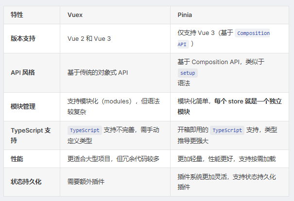

## vue2和vue3的区别？

:::warning 区别
- 性能优化
  
Vue3的虚拟DOM采用了更高效的 Diff算法，减少了渲染和更新的开销。

Tree-shaking 支持：Vue3的代码结构模块化，支持按需引入，减小了打包体积。

- Composition API
  
Vue3引入了Composition API，使代码更模块化、复用性更强。

使用 setup() 方法代替了部分选项式 API，通过函数的方式组织逻辑，代码更加清晰简洁。

- 响应式系统改进:

Vue3使用 Proxy 实现响应式，解决了 Vue2使用Object.defineProperty实现响应式的一些局限性，如无法监听新增属性和数组索引变化。

- 新特性：

Teleport：可以将组件的DOM渲染到指定的DOM节点之外，例如模态框、通知等。

Fragment 支持：Vue3支持组件返回多个根节点，不再需要单一根节点。

Vue3原生支持 TypeScript，提供更完善的类型推导和开发体验。

Vue3支持为一个组件绑定多个 v-model，并且可以自定义 prop 和 event 名称。
:::


## Vue 组件的通讯方式有哪些？

组件之间的通讯通常分为父子组件通讯和跨组件通讯。要注意，vue3 组件的通讯方式和 vue2 有一定的区别。
:::info 
父子组件通讯：
- props和emit
- 获取组件实例，调用属性和方法 
vue2:this.$parent/this.$children
vue3：通过ref直接引用组件
- 多v-model绑定和自定义属性名称

跨组件通信：
- Provide / Inject：父组件通过 provide 向后代组件传递数据，后代组件使用 inject 接收数据，适用于深层嵌套组件间的通信。
- vuex：通过全局状态管理库 Vuex 共享状态，实现跨组件通信（vue2）。
- pinia：Pinia 是 Vue 3 推荐的全局状态管理库，替代了 Vuex。
- 事件总线（Vue 2）：Vue 2 中可以通过Event Bus实现组件间的通信，但在 Vue 3 中不推荐使用。
- 全局事件处理器：通过在根组件$root或全局对象上监听事件，进行跨组件通信（Vue 3 推荐使用外部库，如 mitt）。
:::

## Vue 组件的生命周期
Vue 组件的生命周期是指组件从创建到销毁的整个过程，包括组件的初始化、渲染、更新和销毁等阶段。在Vue2和Vue3中，组件的生命周期有一些区别。
:::info vue2
创建阶段

1️⃣ beforeCreate：组件实例刚被创建，数据观测和事件/监听器设置之前。此时无法访问 data 、 computed 和 methods 等。 

2️⃣ created：组件实例已创建，数据观测、事件/监听器设置完成，此时可以访问 data 、 computed 和 methods 等，通常用于数据初始化。

挂载阶段

3️⃣ beforeMount：在挂载开始之前，模板已编译， el 和 template 已经确定，但尚未渲染。

4️⃣ mounted：组件实例挂载到 DOM 上之后，此时可以访问和操作 DOM。

更新阶段

5️⃣ beforeUpdate：数据发生变化，DOM 尚未更新。可以在这里做一些数据处理，避免不必要的渲染。

6️⃣ updated：数据变化，DOM 更新后调用。此时组件的 DOM 已经更新，可以访问和操作新的 DOM。

销毁阶段

7️⃣ beforeDestroy：组件实例销毁之前。可以在此阶段进行清理工作，例如移除事件监听器、定时器等。 

8️⃣ destroyed：组件实例销毁之后。此时，所有的事件监听器和子组件已被销毁。
:::

::: info vue3
创建阶段

1️⃣ onBeforeMount：等效于 Vue 2 中的 beforeMount ，在组件挂载之前调用。

2️⃣ onMounted：等效于 Vue 2 中的 mounted ，在组件挂载之后调用。

更新阶段

3️⃣ onBeforeUpdate：等效于 Vue 2 中的 beforeUpdate ，在数据更新之前调用。

4️⃣ onUpdated：等效于 Vue 2 中的 updated ，在数据更新并渲染之后调用。

销毁阶段

5️⃣ onBeforeUnmount：等效于 Vue 2 中的 beforeDestroy ，在组件卸载前调用。

6️⃣ onUnmounted：等效于 Vue 2 中的 destroyed ，在组件卸载后调用。

:::
::: warning setup
setup 作为 Vue3 的 Composition API 的一部分, 其内部函数的执行时机早于Mounted钩子。
```javascript
<script setup>
  import { ref, onMounted } from 'vue';
  console.log("setup");
  onMounted(() => {
  console.log('onMounted');
  });
  // 执行结果:setup onMounted
</script>
```
:::

## Vue 组件在哪个生命周期发送 ajax 请求？
created 钩子

优点： ✅ 更快获取数据：能尽早获取服务端数据，减少页面加载时间。 ✅ SSR 支持：支持服务器端渲染（SSR），在 SSR 环境中不会受到限制。

缺点 ❌ UI 未渲染时发起请求：如果需要操作 DOM 或渲染数据，可能导致闪屏问题

mounted 钩子

优点： ✅ DOM 可用：适合需要操作 DOM 或渲染数据后再发起请求的情况，避免闪屏。

缺点 ❌ 请求延迟：数据请求会稍微延迟，增加页面加载时间。 ❌ SSR 不支持：mounted 只在客户端执行，不适用于 SSR 环境。


## Vue 父子组件生命周期调用顺序

1️⃣ 创建阶段

- 父组件：beforeCreate ➡️ created
- 子组件：beforeCreate ➡️ created
- 顺序： 父组件的 beforeCreate 和 created 先执行 ，子组件的 beforeCreate 和 created 后执行。

原因：父组件需要先完成自身的初始化（如 data、computed 等），才能解析模板中的子组件并触发子组件的初始化。

2️⃣ 挂载阶段
- 父组件：beforeMount
- 子组件：beforeMount ➡️ mounted
- 父组件：mounted
- 顺序： 父 beforeMount → 子 beforeCreate→ 子 created→ 子 beforeMount→ 子 mounted → 父 mounted
  
原因：父组件在挂载前（beforeMount）需要先完成子组件的渲染和挂载，因为子组件是父组件模板的一部分。只有当所有子组件挂载完成后，父组件才会触发自身的 mounted。

3️⃣ 更新阶段
- 父组件：beforeUpdate
- 子组件：beforeUpdate ➡️ updated
- 父组件：updated
- 顺序： 父 beforeUpdate → 子 beforeUpdate → 子 updated → 父 updated
  
原因：父组件的数据变化会触发自身更新流程，但子组件的更新必须在父组件更新前完成（因为子组件可能依赖父组件的数据），最终父组件的视图更新完成。

4️⃣ 销毁阶段
- 父组件：beforeDestroy
- 子组件：beforeDestroy ➡️ destroyed
- 父组件：destroyed
- 顺序： 父 beforeDestroy → 子 beforeDestroy → 子 destroyed → 父 destroyed

原因：父组件销毁前需要先销毁所有子组件，确保子组件的资源释放和事件解绑，避免内存泄漏。

:::warning
注：vue3中，setup() 替代了 beforeCreate 和 created，但父子组件的生命周期顺序不变。
:::

## v-show 和 v-if 的区别
- 渲染方式： 💡v-if：条件为 true 时才会渲染元素，条件为 false 时销毁元素。 💡v-show：始终渲染元素，只是通过 CSS 控制 display 属性来显示或隐藏。
- 适用场景： 💡v-if：适用于条件变化不频繁的场景。 💡v-show：适用于条件变化频繁的场景。


## 为何v-if和v-for不能一起使用？
v-if 和 v-for 不能直接一起使用的原因，主要是因为它们在 解析优先级 和 逻辑处理 上存在冲突。
:::info
由于v-for 的解析优先级高于 v-if，同时使用 v-if 和 v-for，Vue 首先会循环创建所有dom元素，然后根据条件来判断是否渲染每个元素，这种方式可能导致 Vue 进行大量的 DOM 操作，性能较差。其次，v-for 会为每个循环项创建一个新的作用域，而 v-if 的条件如果依赖于这个作用域内的数据，可能导致判断逻辑异常。

为避免上述问题，vue官方推荐我们将 v-if 放到 v-for 外层，或者将 v-if 放置到 v-for 内部的单个节点上。

```javascript
<div v-if="show">
  <div v-for="item in list" :key="item.id">{{ item.name }}</div>
</div>
```
:::

## computed和watch的区别？
computed用于计算基于响应式数据的值，并缓存结果:
```js
<template>
  <div>
    <p>原始值：{{ count }}</p>
    <p>计算后的数值：{{ doubledCount }}</p>
  </div>
</template>

<script setup>
import { ref, computed } from 'vue'

const count = ref(2)

// 计算属性
const doubledCount = computed(() => count.value * 2)
```
watch用于监听数据变化并执行副作用操作
```js
<template>
  <div>
    <p>原始数值：{{ count }}</p>
    <button @click="count++">增加数值</button>
  </div>
</template>

<script setup>
import { ref, watch } from 'vue'

const count = ref(0)

// 监听器
watch(count, (newVal, oldVal) => {
  console.log(`数值从 ${oldVal} 变为 ${newVal}`)
})
</script>
```

## watch 和 watchEffect 的区别
watch 和 watchEffect 都是 Vue 3 中用于响应式数据变化时执行副作用的 API，它们的使用场景和工作机制存在区别：
:::info
- 依赖追踪方式

``watch`` ：需要显式声明依赖，监听指定的数据源；可以监听多个数据源或进行深度监听。
```js
import { watch, reactive } from 'vue'
const state = reactive({
  count: 0,
})
watch(
  () => state.count, // 显式声明监听的依赖
  (newCount, oldCount) => {
    console.log(`新值 ${newCount} 老值 ${oldCount}`)
  }
)
```
``watchEffect`` ：会自动追踪 作用域内所有的响应式依赖，不需要显式声明依赖
```js
import { watchEffect, reactive } from 'vue'
const state = reactive({
  count: 0,
})
watchEffect(() => {
  console.log(`Count 变化了: ${state.count}`) // 自动追踪 `state.count`
})
```

- 执行时机
watch ：在监听的响应式数据变化后立即执行。
watchEffect ：在 组件挂载时 执行一次副作用，并在 依赖发生变化时 再次执行。
- 适用场景
watch ：适用于 监听特定数据 变化并执行副作用的场景，如 API 请求、保存操作等。适合需要 访问新值和旧值 进行比较的场景。
watchEffect ：不需要访问旧值，适用于 自动追踪多个响应式依赖 的副作用，如渲染、自动保存等。
:::

## 🔥Vue3 ref 和 reactive 如何选择？
ref 和 reactive 都是 Vue 3 中用来创建响应式数据的 API，他们的区别及使用场景如下。
- reactive原理： 通过 Proxy 对对象或数组的每个属性进行深度代理，实现响应式。
:::warning
这种设计使得 reactive 能自动追踪所有嵌套属性的变化，但由于 Proxy 无法直接处理基本数据类型（如 number 、 string 、 boolean ），因此， reactive 不适用于基本数据类型
:::
- ref原理：ref的实现： 为了实现基本数据类型的响应式，Vue 设计了 ref 。 ref 会将基本数据类型封装为一个包含 value 属性的对象，通过 getter 和 setter 实现响应式依赖追踪和更新。当访问或修改 ref.value 时，Vue 内部会触发依赖更新。此外，对于复杂数据类型（如对象或数组）， ref 的内部实现会直接调用 reactive ，将复杂数据类型变为响应式。

:::info
Vue官方建议使用 ref() 作为声明响应式状态的主要，因为 reactive 存在以下局限性：
- 有限的值类型：它只能用于对象类型 (对象、数组和如 Map、Set 这样的集合类型)。它不能持有如 string、number 或 boolean 这样的原始类型。 
- 不能替换整个对象：由于 Vue 的响应式跟踪是通过属性访问实现的，因此我们必须始终保持对响应式对象的相同引用。这意味着我们不能轻易地“替换”响应式对象，因为这样的话与第一个引用的响应性连接将丢失
```js
let state = reactive({
  count: 0,
})

// 上面的 ({ count: 0 }) 引用将不再被追踪
// (响应性连接已丢失！)
state = reactive({
  count: 1,
})
```
- 对解构操作不友好：当我们将响应式对象的原始类型属性解构为本地变量时，或者将该属性传递给函数时，我们将丢失响应性连接
```js
const state = reactive({
  count: 0,
})
// 当解构时，count 已经与 state.count 断开连接
let { count } = state
// 不会影响原始的 state
count++

// 该函数接收到的是一个普通的数字
// 并且无法追踪 state.count 的变化
// 我们必须传入整个对象以保持响应性
callSomeFunction(state.count)
```
:::

## 什么是动态组件？如何使用它？
动态组件是 Vue 提供的一种机制，允许我们根据条件动态切换渲染的组件，而不需要手动修改模板。 在Vue中，我们可以通过 ``<component>`` 标签的 :is 属性指定需要渲染的组件：
```js
<template>
  <div>
    <!-- 动态渲染组件 -->
    <component :is="currentComponent"></component>

    <!-- 控制组件切换 -->
    <button @click="currentComponent = 'ComponentA'">显示组件A</button>
    <button @click="currentComponent = 'ComponentB'">显示组件B</button>
  </div>
</template>

<script setup>
import { ref } from 'vue'
import ComponentA from './ComponentA.vue'
import ComponentB from './ComponentB.vue'

// 当前显示的组件
const currentComponent = ref('ComponentA')
</script>
```
``<component>`` 标签的 :is 属性值可以是：
- 被注册的组件名
- 导入的组件对象
- 一般的 HTML 元素
当使用 ``<component :is="...">`` 来在多个组件间作切换时，被切换掉的组件会被卸载。如果需要保留动态组件状态，使用 ``<KeepAlive>`` 组件即可。

## 什么是 slot ，有什么应用场景？
slot 是 Vue 中的一种用于 组件内容分发 的机制。它允许父组件向子组件插入内容，从而使组件更加灵活和可复用。

在Vue中，插槽的使用方式可以分为四种：默认插槽、具名插槽、条件插槽和作用域插槽。
- 默认插槽
```js
<template>
  <div>
    <p>我是子组件的标题</p>
    <slot></slot>
  </div>
</template>
```
- 具名插槽
```js
<template>
  <slot name="header">默认标题</slot>
  <slot>默认内容</slot>
  <slot name="footer">默认页脚</slot>
</template>
```
- 条件插槽
```js
<template>
  <div class="card">
    <div v-if="$slots.header" class="card-header">
      <slot name="header" />
    </div>

    <div v-if="$slots.default" class="card-content">
      <slot />
    </div>

    <div v-if="$slots.footer" class="card-footer">
      <slot name="footer" />
    </div>
  </div>
</template>
```
- 作用域插槽:作用域插槽可以让子组件在渲染时将一部分数据提供给插槽，从而实现父组件的插槽访问到子组件的状态。
```js
<template>
  <ul>
    <!-- 定义作用域插槽，并将 items 数据传递给父组件 -->
    <slot :items="items"></slot>
  </ul>
</template>
```
:::warning
应用场景

💡灵活的组件内容插入： 插槽允许我我们将内容插入组件中，而无需修改子组件内部逻辑，极大提高了组件的灵活性。

💡构建通用组件： 比如开发卡片、模态框、列表等组件，使用插槽可以轻松实现内容的自定义。模态框组件可通过插槽自定义标题、正文和按钮。

💡减少重复代码： 通过插槽，将公共逻辑封装到子组件中，而在父组件中只需插入变化的内容。
:::

## Vue 项目可做哪些性能优化？
```js
在 Vue 项目中，我们可以利用 Vue 特有的功能和机制实现性能优化。
1️⃣ 模板和指令优化
合理的使用 v-if 和 v-show 指令，避免不必要的渲染。
使用 v-for 时，尽量提供唯一的 key ，避免重复渲染。
使用 v-once 指令，只渲染一次，避免不必要的计算。
使用 v-memo 指令，对使用v-for生成的列表进行渲染优化。(vue3.2新增)
2️⃣ 组件优化
合理使用 keep-alive 组件，缓存组件实例，避免重复渲染。
使用异步组件加载，减少首屏加载时间。
const AsyncComponent = defineAsyncComponent(() => import('./MyComponent.vue'))
配合 Vue Router 使用路由懒加载，实现路由页面按需加载。
合理划分组件，提升复用性和渲染性能。
3️⃣ 响应式优化
使用 Object.freeze 冻结对象，避免不必要的响应式。
使用 stop 停止 不必要的watchEffect副作用执行，以减少性能消耗。
watch的优化:
 避免滥用深度监听，降低性能开销。
💡 对于频繁触发的响应式数据变化，可以通过防抖和节流优化监听逻辑。
import { debounce } from 'lodash'
watch(
  () => searchQuery,
  debounce((newQuery) => {
    fetchSearchResults(newQuery)
  }, 300)
)
可以通过返回函数只监听具体的依赖，减少不必要的触发。
watch([() => user.name, () => user.age], ([newName, newAge]) => {
  //...
})

当监听器在某些条件下不再需要时，可以通过返回的 stop 方法手动停止监听，以节省资源
const stop = watch(
  () => data.value,
  (newValue) => {
    if (newValue === 'done') {
      stop() // 停止监听
    }
  }
)
当多个监听器的回调逻辑类似时，可以合并监听
watch([() => user.name, () => user.age], ([newName, newAge]) => {
  //...
})

```

## 什么是 nextTick 如何应用它
在 Vue.js 中， nextTick 是一个核心工具方法，用于处理 DOM 更新时机问题。它的核心作用是：在下次 DOM 更新循环结束后执行回调，确保我们能操作到最新的 DOM 状态。 它的使用场景如下：
```js
数据变化后操作DOM:
<script setup>
async function increment() {
  count.value++
  // DOM 还未更新
  console.log(document.getElementById('counter').textContent) // 0
  await nextTick()
  // DOM 此时已经更新
  console.log(document.getElementById('counter').textContent) // 1
}
</script>

<template>
  <button id="counter" @click="increment">{{ count }}</button>
</template>
在生命周期钩子中操作DOM:
<script setup>
import { ref, onMounted, nextTick } from 'vue'
// 创建 DOM 引用
const element = ref(null)

onMounted(() => {
  // 直接访问可能未渲染完成
  console.log(element.value.offsetHeight) // 0 或未定义
  // 使用 nextTick 确保 DOM 已渲染
  nextTick(() => {
    console.log(element.value.offsetHeight) // 实际高度
  })
})
</script>
```
:::warning
注意，在vue2中和vue3的选项式 API中，我们使用this.$nextTick(callback)的方式调用。
this.$nextTick(() => {
  console.log(this.$refs.text.innerText) // "更新后的文本"
})
:::

## 使用 Vue3 Composable 组合式函数，实现 useCount
:::tip
在 Vue 应用的概念中，“组合式函数”(Composables) 是一个利用 Vue 的组合式 API 来封装和复用有状态逻辑的函数。它和自定义 React hooks 非常相似。
:::
使用组合式函数实现如下需求：useCount 是一个计数逻辑管理的组合式函数，它返回一个 count 变量和增加、减少、重置count的方法。
```js
<script setup>
import { ref } from 'vue'

// 实现 useCount 组合式函数
function useCount() {
  const count = ref(0)
  const increment = () => {
    count.value++
  }
  const decrement = () => {
    count.value--
  }
  const reset = () => {
    count.value = 0
  }
  return {
    count,
    increment,
    decrement,
    reset,
  }
}

// 使用 useCount 组合式函数
const { count, increment, decrement, reset } = useCount()
</script>
```

## 使用 Vue3 Composable 组合式函数，实现 useRequest
const { loading, data, error } = useRequest(url) // 可只考虑 get 请求
```js
import { ref, computed } from 'vue';
import axios from 'axios';

// 实现 useRequest 组合式函数
function useRequest(url) {
  const loading = ref(false); // 请求状态
  const data = ref(null); // 响应数据
  const error = ref(null); // 错误信息
  const fetchData = async () => {
    loading.value = true;
    error.value = null;
    try {
      const response = await axios.get(url); /
      data.value = response.data;
    } catch (err) {
      error.value = err.message || '请求失败'; /
    } finally {
      loading.value = false;
    }
  };
  // 自动触发请求
  fetchData();
  return {
    loading,
    data,
    error,
  };
}
export default useRequest;
```

## 自定义组件如何实现 v-model
v-model 可以在组件上使用以实现双向绑定。
:::details vue2
在vue2中，自定义组件使用 v-model ，需要在组件内部定义 value prop，然后通过 this.$emit('input', newValue) 触发更新即可
```js
<!-- CustomInput.vue -->
<template>
  <input :value="value" @input="$emit('input', $event.target.value)" />
</template>

<script>
export default {
  props: ['value'],
}
</script>
```
:::

:::details vue3
与vue2类似，vue3自定义组件使用 v-model ，需要在组件内部定义 modelValue prop，然后通过 emit('update:modelValue', newValue) 触发更新
```js
<!-- CustomInput.vue -->
<template>
  <input :value="modelValue" @input="$emit('update:modelValue', $event.target.value)" />
</template>

<script setup>
defineProps(['modelValue'])
defineEmits(['update:modelValue'])
</script>
使用方式：
<CustomInput v-model="searchText" />
```
👉注意，从 Vue 3.4 开始，官方推荐的实现方式是使用 defineModel() 宏：
```js
<!-- Child.vue -->
<script setup>
const model = defineModel()

function update() {
  model.value++
}
</script>

<template>
  <div>父组件的 v-model 值为: {{ model }}</div>
  <button @click="update">Increment</button>
</template>
```
父组件使用 v-model 绑定一个值：
```js
<!-- Parent.vue -->
<Child v-model="countModel" />
```
defineModel 是一个便利宏，其返回的值是一个 ref 。它可以像其他 ref 一样被访问以及修改，不过它能起到在父组件和当前变量之间的双向绑定的作用：
- 它的 .value 和父组件的 v-model 的值同步
- 当它被子组件变更了，会触发父组件绑定的值一起更新。 根据 defineModel 的特性，我们可以用 v-model 把这个 ref 绑定到一个原生 input 元素上：
```js
<script setup>
const model = defineModel()
</script>

<template>
  <input v-model="model" />
</template>
```
:::

### 如何统一监听 Vue 组件报错
在 Vue 3 中，可以通过 全局错误处理器 （errorHandler） 和 生命周期钩子（例如 onErrorCaptured ）来统一监听和处理组件中的错误。
- 通过全局错误处理器 app.config.errorHandler
```js
import { createApp } from 'vue';
const app = createApp(App);
// 设置全局错误处理器
app.config.errorHandler = (err, instance, info) => {
  console.error('捕获到组件错误: ', err);
  console.log('发生错误的组件实例: ', instance);
  console.log('错误信息: ', info);
};

app.mount('#app');
```
- 局部错误捕获（onErrorCaptured）
onErrorCaptured 钩子可以捕获后代组件传递过程中的错误信息
```js
<script setup>
import { onErrorCaptured } from 'vue'

onErrorCaptured((err, instance, info) => {
  console.error('局部捕获到错误: ', err)
  console.log('错误来源组件: ', instance)
  console.log('错误信息: ', info)

  // 这个钩子可以通过返回 false 来阻止错误继续向上传递。
  return false // 如果需要让错误冒泡到全局，省略或返回 true
})
</script>

<template>
  <div>
    <h2>局部错误捕获示例</h2>
    <ErrorProneComponent />
  </div>
</template>
```

## Vuex 中 mutation 和 action 有什么区别？
在 Vuex 中， mutation 和 action 是用于管理状态的两种核心概念。
mutation 可以直接修改 store 中的 state值，它只支持同步操作。 Action 不能直接修改 state，而是通过调用 mutation 来间接修改，它用于处理异步操作
```js
const store = createStore({
  state: {
    count: 0, // 定义状态
  },
  mutations: {
    // Mutation 示例（同步）
    increment(state, payload) {
      state.count += payload
    },
  },
})

// 组件中调用
this.$store.commit('increment', 5)
```

## Vuex 和 Pinia 有什么区别？
Pinia 和 Vuex 都是 Vue 的专属状态管理库，允许用户跨组件或页面共享状态。


:::details vuex
```js
// store.js
import { createStore } from 'vuex'

const store = createStore({
  state: {
    count: 0,
  },
  mutations: {
    increment(state) {
      state.count++
    },
  },
  actions: {
    asyncIncrement({ commit }) {
      setTimeout(() => {
        commit('increment')
      }, 1000)
    },
  },
  getters: {
    doubleCount: (state) => state.count * 2,
  },
})

export default store
```
组件中使用
```js
<script>
export default {
  // 计算属性
  computed: {
    count() {
      return this.$store.state.count
    },
    doubleCount() {
      return this.$store.getters.doubleCount
    },
  },
  methods: {
    // 同步增加
    increment() {
      this.$store.commit('increment')
    },
    // 异步增加
    asyncIncrement() {
      this.$store.dispatch('asyncIncrement')
    },
  },
}
</script>
```
:::

:::details pinia
```js
// store.js
import { defineStore } from 'pinia'

export const useCounterStore = defineStore('counter', {
  state: () => ({
    count: 0,
  }),
  actions: {
    increment() {
      this.count++
    },
    async asyncIncrement() {
      setTimeout(() => {
        this.increment()
      }, 1000)
    },
  },
  getters: {
    doubleCount: (state) => state.count * 2,
  },
})
```
组件中使用：
```js
<script setup>
import { useCounterStore } from './store'
const counter = useCounterStore()
</script>

<template>
  <h1>Count的计算值 {{ counter.count }}</h1>
  <h2>Double的计算值 {{ counter.doubleCount }}</h2>
  <button @click="counter.increment">同步增加</button>
  <button @click="counter.asyncIncrement">异步增加</button>
</template>
```
:::
对于vue3项目，官方推荐使用pinia。因为它更轻量、TypeScript 支持更好、模块化更简单且拥有更强的 DevTools 支持。

## Vue-router 导航守卫能用来做什么？
vue Router 的导航守卫用于在路由跳转过程中对导航行为进行拦截和控制。这些守卫在路由进入、离开或更新时执行，可以用于多种场景，确保应用的导航逻辑符合预期。以下是常见的用途：
- 认证和授权
```js
用于检查用户的登录状态或权限，防止未授权用户访问受限页面:
router.beforeEach((to, from, next) => {
  const isAuthenticated = !!localStorage.getItem('token')
  if (to.meta.requiresAuth && !isAuthenticated) {
    next('/login') // 未登录，跳转到登录页
  } else {
    next() // 已登录，正常导航
  }
})
```
- 数据预加载
```js
在进入路由前预加载必要的数据，确保页面渲染时数据已准备好:
router.beforeEach(async (to, from, next) => {
  if (to.name === 'userInfo') {
    await store.dispatch('fetchUserData') // 预加载用户数据
  }
  next()
})
```
- 动态修改页面标题
```js
根据路由信息动态更改浏览器标签页的标题，提升用户体验。
router.afterEach((to) => {
  document.title = to.meta.title || '自定义标题'
})
```
- 动画和加载效果
```js
在路由切换时展示加载动画或过渡效果，提升用户体验。
router.beforeEach((to, from, next) => {
  store.commit('setLoading', true) // 开始加载动画
  next()
})

router.afterEach(() => {
  store.commit('setLoading', false) // 结束加载动画
})
```

- 日志记录和分析
```js
在路由切换时记录用户行为，用于分析或调试。
router.afterEach((to, from) => {
  console.log(`用户从 ${from.fullPath} 跳转到 ${to.fullPath}`)
})
```
- 防止访问不存在的页面
```js
通过守卫检查路由是否存在，避免导航到无效页面。
router.beforeEach((to, from, next) => {
  const routeExists = router.getRoutes().some((route) => route.name === to.name)
  if (!routeExists) {
    next('/404') // 跳转到 404 页面
  } else {
    next()
  }
})
```