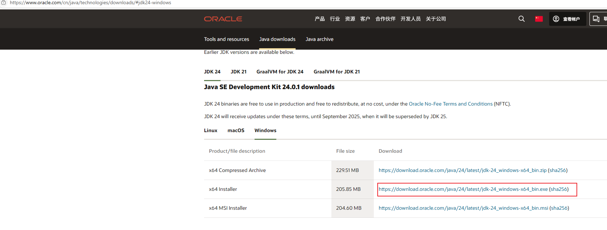
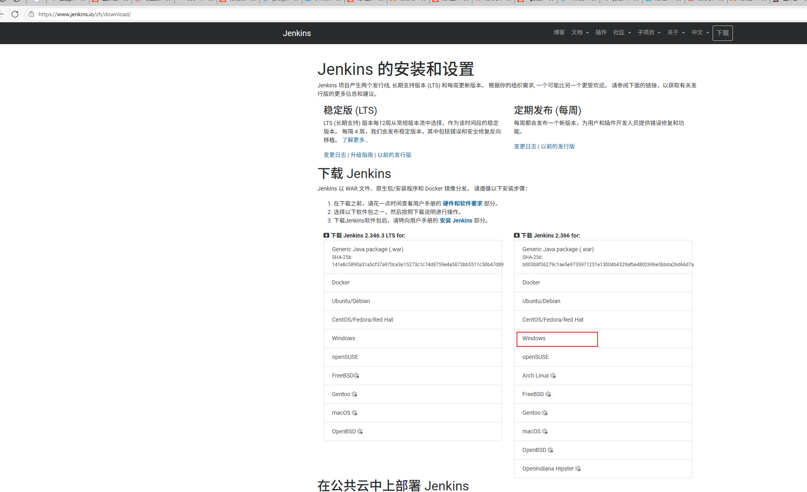
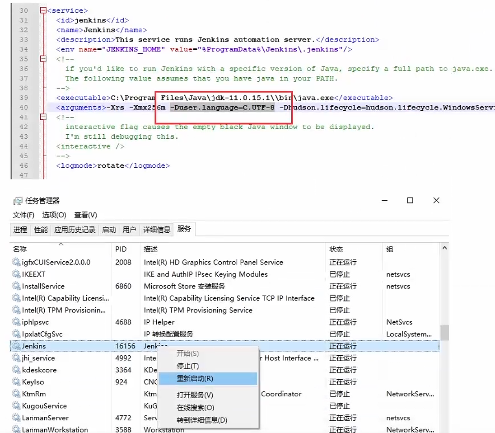
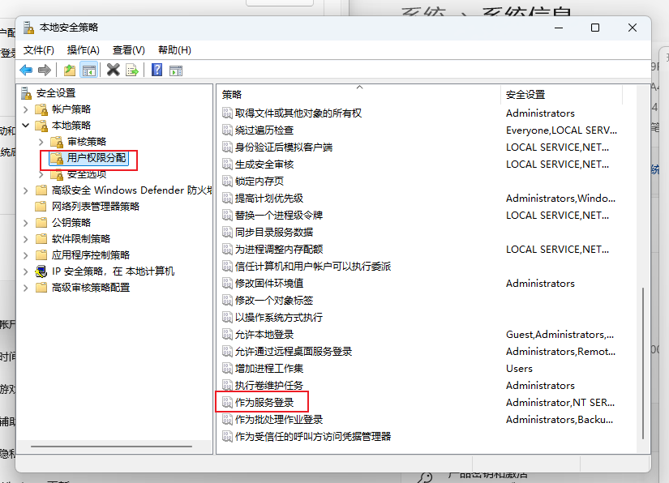
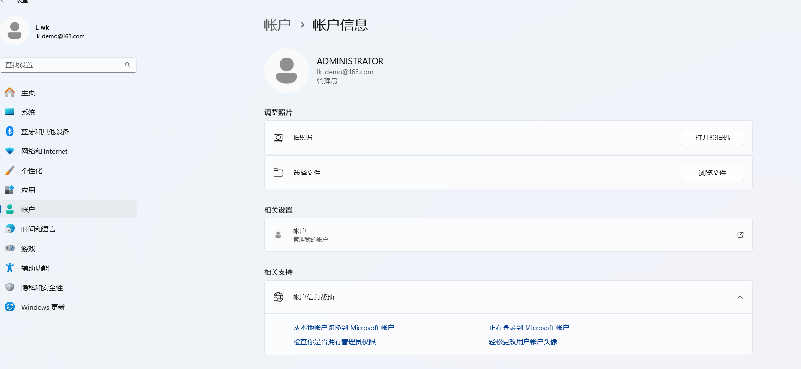
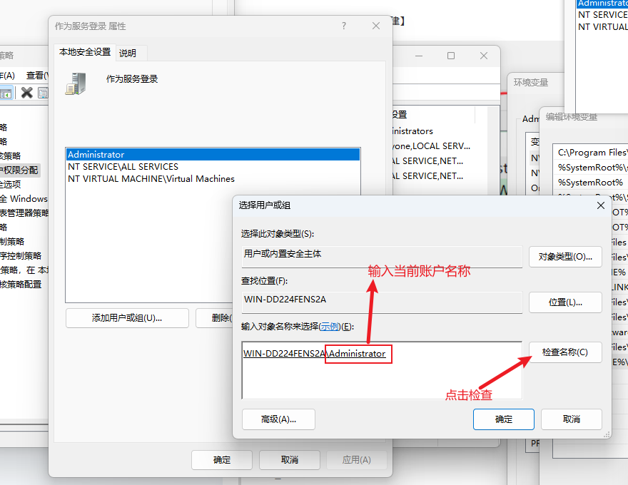

## 产生背景
:::info 背景
原来公司内部的打包流程：本地打包->登录服务器->上传压缩包->解压缩

引发的问题：
- 保持依赖的正确性；本地环境会影响代码，有的依赖升级了，但是package.json里面的依赖还是原来的，实际里面的依赖已经不是了，这样的话，如果更换了前端的环境就有可能有问题
- 本地打包影响开发编码，会浪费很多时间在发包部署上面
:::
为了解决这个问题，我在自己本地部署了一个jenkins,给组内的前端成员进行打包，接下来就简单梳理下：

window下的jenkins如何部署？

:::tip
想要安装jenkins,就必须要安装jdk和jenkins的安装包
- jdk21: https://www.oracle.com/cn/java/technologies/downloads/#jdk21-windows

- jenkins: https://www.jenkins.io/zh/download/

:::


## jenkins的基本使用
安装完推荐的插件以后，我们进入到当前的jenkins中：
:::info 开始
进入到jenkins中，我们发现一个问题，汉化仅仅汉化


:::


## jenkins 部分汉化，应该怎么解决？
在window上面安装jenkins，并且安装了汉化插件，还是出现汉化不全的情况：
在linux安装相同版本是完美汉化的，在window上面确实不对的，所以猜测应该是window和linux的差异：
linux 的语言默认是c.utf-8,c.utf-8是默认的语言环境，而有的机器是en_US.utf-8
- 于是在window的jenkins的安装目录修改配置文件jenkins.xml文件
- 在大概40行的位置，java启动参数里面增加 -Duer.language=C.UTF-8参数来指定语言，重启jenkins



## 怎么解决npm私服配合jenkins自动化构建


## jdk配置环境变量
:::tip
安装步骤：下载以后就直接选中文件夹进行安装就好了
- 我的电脑右键，打开属性
- 高级系统设置，找到环境变量
- 在系统变量上新建
变量名：JAVA_HOME  变量值：D:\jdk（jdk的安装路径）
- 在系统变量上新建
变量名：CLASSPATH 变量值：.;%JAVA_HOME%\lib\;%JAVA_HOME%\lib\tools.jar
- 在系统变量上点击path,新建一个值：%JAVA_HOME%\bin
- 最后打开cmd,java -verison,测试打印结果，输出jdk的版本号就是成功了
:::


## window家庭版不能打开本地策略，解决方案
:::tip
- 1.在桌面创建一个文本文件  aaa.txt
- 2.编辑文本,填充代码
```javascript
@echo off
pushd "%~dp0"
dir /b C:\Windows\servicing\Packages\Microsoft-Windows-GroupPolicy-ClientExtensions-Package~3*.mum >List.txt
dir /b C:\Windows\servicing\Packages\Microsoft-Windows-GroupPolicy-ClientTools-Package~3*.mum >>List.txt
for /f %%i in ('findstr /i . List.txt 2^>nul') do dism /online /norestart /add-package:"C:\Windows\servicing\Packages\%%i"
pause
```
:::
- 修改后缀名 .txt -> .cmd
- 4.以管理员权限运行
- 5.等待安装
- 6.win+r 打开运行，输入gpedit.msc即可运行

## 有本地安全策略，但是安装jenkins的时候，采用登录账户验证不通过怎么解决？

找到你的登录账户信息：

添加用户：

这样就可以用这个账号登录了


## 参考连接：
- https://juejin.cn/post/7171741567751815199?searchId=20250612140340EFE29A46BCE81DBF9E13
- https://blog.csdn.net/u013571586/article/details/126976005